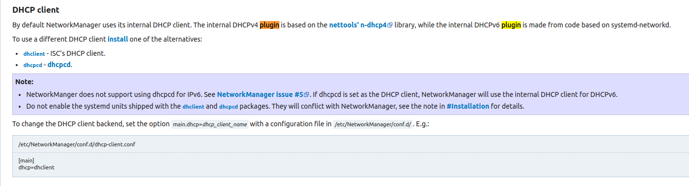

# Red Hat Enterprise Linux 8 - Changes

## 1. Repositories

1. BaseOS       -   Core set of OS, foundation of all installations
2. AppStream    -   Additional userspace apps, runtime languages, databases etc.
3. CodeReady    -   Additional packages for use by developers.


* BaseOS and AppStream required for a RHEL8 installation
* Appstream formats:
    * RPM format
    * Modules - Extension to RPM format
* CodeReady repository:
  * Not mandatory for a RHEL8 installation
  * Enabled separately
  * Available for all RHEL8 subscriptions

* The RHEL ISO contains both the BaseOS and AppStream repositories.

* Use `subscription-manager` to register your machine to Red Hat Network
* Use `subscription-manager auto-attach` to attach it to an available subscription.
* Do a `yum repolist` to automatically populate the repositories in `/etc/yum.repos.d/redhat.repo`
* If it complains, use `yum refresh` to refresh the metadata from Red Hat Network, and try again.

### 1.1. AppStream or Application Streams

* Application Streams (AppStream) contains multiple versions of the same component.
    * For eg: Mariadb v1, v2, vN (which is not possible in the previous repos)
    * Packages in AppStream are updated more frequently than BaseOS repo.
    * Makes it easy to carry several versions of the same utility, with a common Base OS.
    * Much easier for enterprises trying to use newer versions of software.
    * Separate lifecycle per AppStream component.

* Modules are collection of packages, built, tested, and released as a single unit.
* Only a single module stream per collection, can be installed at a time.
  * Eg: Two different streams of PostgreSQL, v10 (default stream) and v9.6

## 2. Installer

* Anaconda now supports multiple Stage2 locations, in case one of them fails.
* `syspurpose` can be used to set the system purpose, which can also be set in the Installer GUI.
* This enables the Red Hat entitlement server to auto-attach a relevant subscription.
* Anaconda now understands AppStream modules, and the various combinations that can be installed.
* Kickstart files from RHEL7 and before may not work in RHEL8, due to the BaseOS/AppStream repo changes.

## 3. authconfig and authselect
* `authconfig` is deprecated, in favour of `authselect`.
* `authselect` works by enabling to select a profile from a list of profiles.
* A custom profile can be loaded, if the available ones does not meet the requirement.

## 4. RHEL image creation

* RHEL8 ships an image builder tool that can create customized RHEL images
* Available in AppStream in `lorax-composer` package.
* Two interfaces:
  * GUI interface in Cockpit
  * CLI - `composer-cli`
* Can build various output formats:
  * Live ISO
  * QCOW2
  * File system image file
  * Cloud images for Azure, OpenStack, VMWare, AWS...

## 5. Software management

* Yum v3 has moved to Yum v4, based on DNF API
* Features
  * Faster
  * Supports Modular content (AppStreams)
  * Stable DNF API
  * Compatible with Yum v3, wrt config files and CLI
  * Not compatible with Yum v3 plugins (most of them are ported to DNF though)

* /var/log/yum.log not available in RHEL8, no direct equivalent.
* Use `yum history` for install logs.
* /var/log/dnf.rpm.log - Not an exact map to yum.log, but useful.

## 6. Infrastructure services

### 6.1. NTP with Chrony

* RHEL8 supports NTP protocol via the Chronyd daemon.
  * RHEL7 had both `ntp` daemon and `chronyd` daemon.

### 6.2. DNS with Bind

* New zone file format called `map`.
  * Enables the zone to be mapped directly to system memory.
  * Faster loading and access times, compared to normal zone files.
* DNS cookies can be sent with `named` service and `dig`.
* New tool: `delv`
  * Domain Entity Lookup and Validation (delv)
  * Similar to `dig`
  * Can use to perform DNSSEC (DNS Security Extensions) validation
* New tool: `mdig`
  * Sends multiple queries and wait for responses.
  * `dig` used to send one query and wait for reply before sending the next.
* `named` service checks for other named processes before startup.
* Smaller size in zone transfers, reduces network bandwidth.
* In RHEL8, `nslookup` and `host` ignores responses from name servers without recursion set.
  * The BIND version in RHEL7 used to allow such responses.
  * In RHEL8, the name lookup

## 7. Networking

### 7.1. Utilities
* In RHEL8, `ifup` and `ifdown` calls `nmcli` in the backend.
  * Hence, NetworkManager should be running for `ifup` and `ifdown` to work.
* The legacy scripts are still available, in the package `network-scripts`
  * This is not installed by default.
  * This also provides the legacy version of the `network` service init script.
  * The `network` service is enabled by default, once the package is installed.
  * If `network-scripts` are installed along NetworkManager, `network-scripts` takes precedence.
  * If both are installed, and the administrator wants to switch to NetworkManager temporarily, use:

```bash
# update-alternatives --config ifup
```

### 7.2. NetworkManager
* NetworkManager in RHEL8, now supports both the `dhclient` plugin and `internal` plugin.
  * In RHEL7, NetworkManager only supported the `internal` plugin.

**NOTE**: Refer the `NetworkManager` page from ArchLinux, for more info on the same.



* `NetworkManager-config-server` is only installed in the `Server` and `Server with GUI` install profiles
  * Install it manually, if required, and if on a different install profile.
  * The `NetworkManager-config-server` adds a NetworkManager configuration file to make it behave more like the legacy "network" service.
  * It stops NetworkManager from automatically running DHCP on unconfigured ethernet devices
  * It also allows connections with static IP addresses to be brought up on ethernet devices with no carrier.
  * This package is intended to be installed by default for server deployments.

### 7.3. IPTables and NFTables

* nfbtables replaces the following tools in RHEL8
  * iptables
  * ip6tables
  * arptables
  * ebtables

* Advantages
  * Looking up tables instead of linear table processing as IPtables
  * Single tool for both IPv4 and IPv6 (compared to iptables/ip6tables)
  * New rules applied automatically
  * Possible to debug and trace using `nftrace` ruleset and `nft` tool
  * API for third-party applications (libnftables, libmnl libraries)