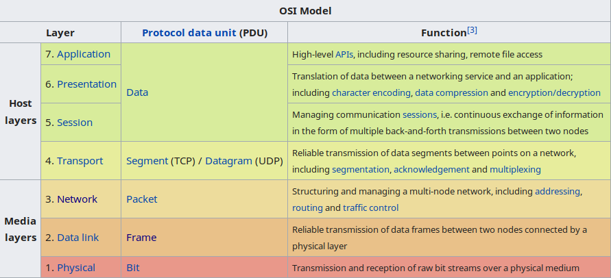
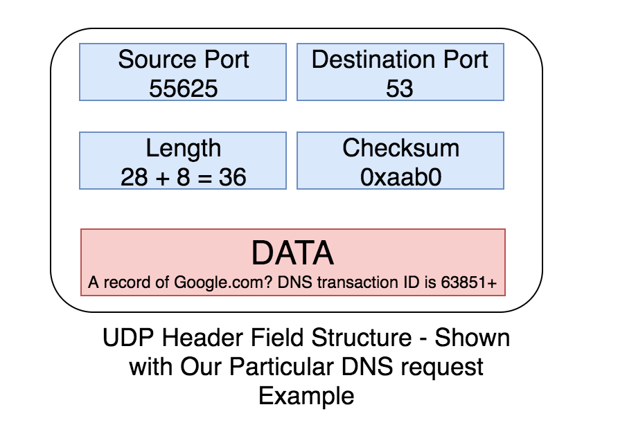
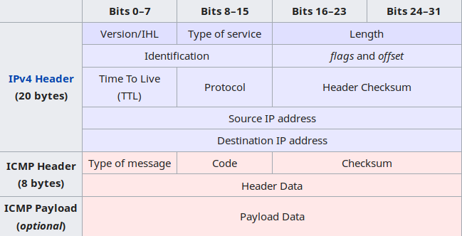
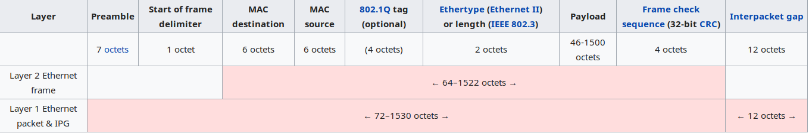
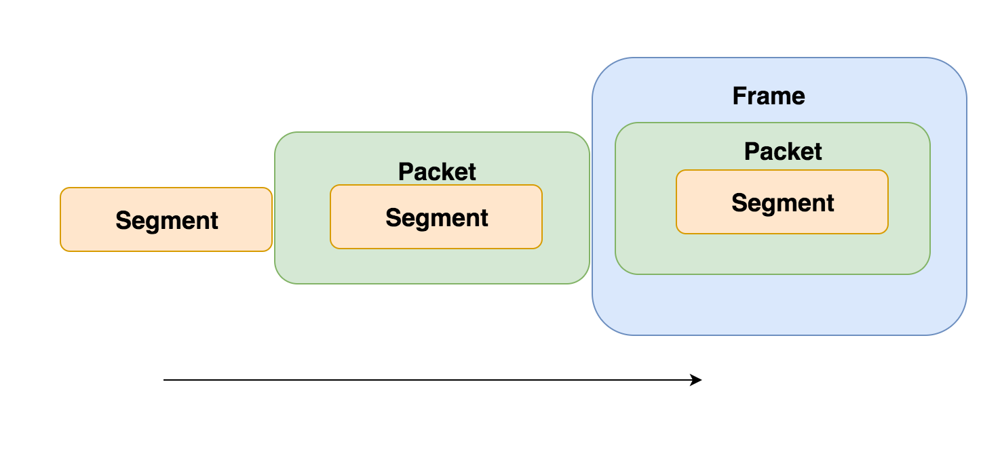
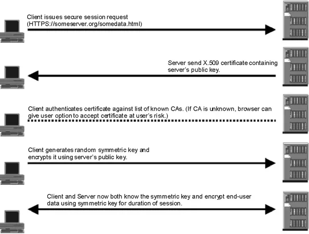
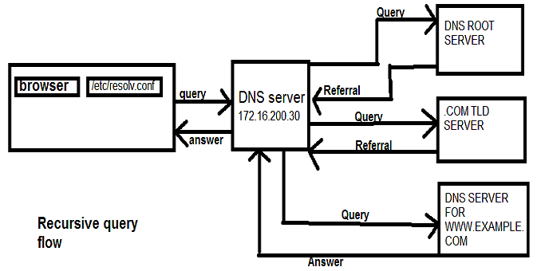

**Table of Contents**  *generated with [DocToc](https://github.com/thlorenz/doctoc)*

- [Networking](#networking)
  - [01. OSI layers](#01-osi-layers)
    - [01.1. Data units in each layer](#011-data-units-in-each-layer)
    - [01.2. Protocols in each OSI layer](#012-protocols-in-each-osi-layer)
    - [01.3. Devices in each OSI layer](#013-devices-in-each-osi-layer)
  - [02. TCP header [Layer 4 - Transport layer]](#02-tcp-header-layer-4---transport-layer)
  - [03. UDP header [Layer 4 - Transport layer]](#03-udp-header-layer-4---transport-layer)
  - [04. ICMP header format [Layer 3 - Network layer]](#04-icmp-header-format-layer-3---network-layer)
  - [05. IP header [Layer 3 - Network layer]](#05-ip-header-layer-3---network-layer)
  - [06. Ethernet Frame header (64 Bytes) [Layer 2 - Data link Layer]](#06-ethernet-frame-header-64-bytes-layer-2---data-link-layer)
    - [06.1. Runt frame](#061-runt-frame)
    - [06.1. Reference](#061-reference)
  - [07. What is a Network MTU? [All layer]](#07-what-is-a-network-mtu-all-layer)
    - [07.1. Reference](#071-reference)
  - [08. What is a Jumbo Frame? [Layer 2 - Data link Layer]](#08-what-is-a-jumbo-frame-layer-2---data-link-layer)
    - [08.1. Can Jumbo frames and 1500 byte frames co-exist?](#081-can-jumbo-frames-and-1500-byte-frames-co-exist)
    - [08.2. Reference](#082-reference)
  - [09. Difference between Segments, Packets, and Frames?](#09-difference-between-segments-packets-and-frames)
  - [10. IPv4 and IPv6, differences [Layer 4 - Transport Layer]](#10-ipv4-and-ipv6-differences-layer-4---transport-layer)
  - [11. IPv4 Address Class range](#11-ipv4-address-class-range)
    - [11.1. Routeable and Un-routeable addresses](#111-routeable-and-un-routeable-addresses)
    - [11.2. Reserved addresses](#112-reserved-addresses)
    - [11.2. What is a loopback address?](#112-what-is-a-loopback-address)
  - [12. Routing [Layer 3 - Network Layer]](#12-routing-layer-3---network-layer)
    - [12.1. The `route` command](#121-the-route-command)
    - [12.2. Routing decisions](#122-routing-decisions)
    - [12.3. Static and Dynamic routes](#123-static-and-dynamic-routes)
    - [12.1. Explain the flags in the output of `route`](#121-explain-the-flags-in-the-output-of-route)
    - [12.2. Routing protocols](#122-routing-protocols)
  - [13. TCP and UDP [Layer 4 - Transport layer]](#13-tcp-and-udp-layer-4---transport-layer)
    - [13.1. Differences](#131-differences)
    - [13.2. How does TCP work?](#132-how-does-tcp-work)
      - [13.2.1. TCP Session Establishment [SYN, ACK+SYN, ACK]](#1321-tcp-session-establishment-syn-acksyn-ack)
      - [13.2.2. Explain TCP Windowing.](#1322-explain-tcp-windowing)
      - [13.2.3. Configure TCP Window in Linux](#1323-configure-tcp-window-in-linux)
      - [13.2.4. TCP connection termination [FIN, ACK, FIN, ACK]](#1324-tcp-connection-termination-fin-ack-fin-ack)
    - [13.3. How does UDP work?](#133-how-does-udp-work)
  - [53. What is Ethernet?](#53-what-is-ethernet)
  - [54. What is a Layer 3 switch?](#54-what-is-a-layer-3-switch)
  - [30. VLANs](#30-vlans)
    - [30.1. Types of VLAN](#301-types-of-vlan)
    - [30.1. Advantages of VLAN](#301-advantages-of-vlan)
    - [30.2. Reference](#302-reference)
  - [40. Trunking](#40-trunking)
    - [40.1. Idea of Trunking](#401-idea-of-trunking)
    - [40.2. Ethernet Frame with VLAN tagging](#402-ethernet-frame-with-vlan-tagging)
    - [40.3. Trunking Modes](#403-trunking-modes)
    - [40.4. VLAN Pruning](#404-vlan-pruning)
    - [40.4. References](#404-references)
  - [15. PING](#15-ping)
    - [15.1. Introduction](#151-introduction)
    - [15.2. How does PING work?](#152-how-does-ping-work)
    - [15.3. ICMP Packet Structure (set over IPv4 header)](#153-icmp-packet-structure-set-over-ipv4-header)
    - [15.4. Explaining the output of `ping`](#154-explaining-the-output-of-ping)
    - [15.5. References](#155-references)
  - [16. Traceroute](#16-traceroute)
    - [16.1. What is TTL, and how is it used in `traceroute`.](#161-what-is-ttl-and-how-is-it-used-in-traceroute)
    - [16.2. How does traceroute work?](#162-how-does-traceroute-work)
    - [16.3. Reference](#163-reference)
  - [17. SSL/TLS](#17-ssltls)
    - [17.1. SSL Certificates](#171-ssl-certificates)
    - [17.2. SSL / TLS Handshake](#172-ssl--tls-handshake)
    - [17.3. Asymmetrical / Public-key cryptography](#173-asymmetrical--public-key-cryptography)
    - [17.4. Symmetric Cryptography](#174-symmetric-cryptography)
    - [17.5. Is SSL/TLS encryption asymmetric or symmetric?](#175-is-ssltls-encryption-asymmetric-or-symmetric)
    - [17.6. Reference](#176-reference)
  - [18. HTTPS (HTTP over TLS or SSL)](#18-https-http-over-tls-or-ssl)
  - [19. HTTP Return codes](#19-http-return-codes)
    - [19.1. 1xx Informational responses](#191-1xx-informational-responses)
    - [19.2. 2xx Success](#192-2xx-success)
    - [19.3. 3xx Redirection](#193-3xx-redirection)
    - [19.4. 4xx Client errors](#194-4xx-client-errors)
    - [19.5. 5xx Server errors](#195-5xx-server-errors)
    - [19.6. References](#196-references)
  - [20. How does URL-forwarding or Geo-Redirection work?](#20-how-does-url-forwarding-or-geo-redirection-work)
  - [21. Dynamic Host Configuration Protocol (DHCP)](#21-dynamic-host-configuration-protocol-dhcp)
    - [21.1. How does DHCP work? (How does a client get an IP address from a DHCP server?)](#211-how-does-dhcp-work-how-does-a-client-get-an-ip-address-from-a-dhcp-server)
    - [21.2. Explain DHCP lease time and how a new IP address is obtained.](#212-explain-dhcp-lease-time-and-how-a-new-ip-address-is-obtained)
  - [22. Domain Name System (DNS)](#22-domain-name-system-dns)
    - [22.1. Recursive and Iterative (non-recursive) DNS query.](#221-recursive-and-iterative-non-recursive-dns-query)
    - [22.2. Explain the various Resource Records in DNS.](#222-explain-the-various-resource-records-in-dns)
    - [22.3. How does a name resolution work?](#223-how-does-a-name-resolution-work)
    - [22.4. What is a TTL, in DNS?](#224-what-is-a-ttl-in-dns)
  - [23. MAIL (SMTP/MTA/MTU/POP/IMAP)](#23-mail-smtpmtamtupopimap)
    - [23.1. How does an MTA send a mail to another domain?](#231-how-does-an-mta-send-a-mail-to-another-domain)
    - [23.2. Difference between IMAP and POP3](#232-difference-between-imap-and-pop3)
    - [23.3. How does SMTP work?](#233-how-does-smtp-work)
    - [23.4. What are MTA and MTU?](#234-what-are-mta-and-mtu)
    - [23.5. Describe the process of delivering an e-mail](#235-describe-the-process-of-delivering-an-e-mail)
  - [24. Explain SSH keys and how they work.](#24-explain-ssh-keys-and-how-they-work)
    - [24.1. Explain a Session establishment for SSH data transfer.](#241-explain-a-session-establishment-for-ssh-data-transfer)
  - [26. Explain Netfilter, IPtables, and its structure (chains).](#26-explain-netfilter-iptables-and-its-structure-chains)
  - [41. Tunneling](#41-tunneling)
  - [42. VPN (Virtual Private Area Network)](#42-vpn-virtual-private-area-network)
  - [44. ARP (Address Resolution Protocol)](#44-arp-address-resolution-protocol)
  - [47. Netfilter, and its uses](#47-netfilter-and-its-uses)
  - [48. Unicast, Multicast, and Broadcast?](#48-unicast-multicast-and-broadcast)
  - [52. What is Network Switching?](#52-what-is-network-switching)
  - [52. Bonding](#52-bonding)
    - [52.1. Explain the different modes of Networking Bonding.](#521-explain-the-different-modes-of-networking-bonding)
  - [55. What are Collision Domains and Broadcast Domains?](#55-what-are-collision-domains-and-broadcast-domains)
  - [56. Network Address Translation (NAT)](#56-network-address-translation-nat)
  - [57. NTP, and its working](#57-ntp-and-its-working)
  - [58. Network Management Protocols](#58-network-management-protocols)
  - [60. Important network protocols](#60-important-network-protocols)
  - [61. Quality of Service (QoS)](#61-quality-of-service-qos)
  - [62. SNMP and its working](#62-snmp-and-its-working)
  - [63. What is Port Knocking?](#63-what-is-port-knocking)
  - [64. What is Promiscous mode?](#64-what-is-promiscous-mode)
  - [65. Tools in Linux to monitor/tune Network. (Refer RHEL Networking guide)](#65-tools-in-linux-to-monitortune-network-refer-rhel-networking-guide)
  - [66. Explain Dynamic DNS (DDNS)](#66-explain-dynamic-dns-ddns)
  - [67. What is the difference between Active and Passive FTP?](#67-what-is-the-difference-between-active-and-passive-ftp)
  - [68. Network Bridge](#68-network-bridge)
  - [69. What is a virtual IP address and when would you use it?](#69-what-is-a-virtual-ip-address-and-when-would-you-use-it)
  - [70. What is a Broadcast storm?](#70-what-is-a-broadcast-storm)
  - [71. What is a SYN flood?](#71-what-is-a-syn-flood)
  - [72. What do you do if you are a victim of a DoS?](#72-what-do-you-do-if-you-are-a-victim-of-a-dos)
  - [73. What is a “spoofed” packet?](#73-what-is-a-spoofed-packet)
  - [74. What is the purpose of VRRP?](#74-what-is-the-purpose-of-vrrp)
  - [75. Using the OSI model, which layer has the responsibility of making sure that the packet gets where it is supposed to go?](#75-using-the-osi-model-which-layer-has-the-responsibility-of-making-sure-that-the-packet-gets-where-it-is-supposed-to-go)
  - [77. Based on what information does your computer know where to send packets?](#77-based-on-what-information-does-your-computer-know-where-to-send-packets)
  - [78. What is a metric?](#78-what-is-a-metric)
  - [79. What can SSH be used for except shell access?](#79-what-can-ssh-be-used-for-except-shell-access)
  - [80. Design a network for the following scenario.](#80-design-a-network-for-the-following-scenario)
  - [83. Describe a difference between TAP and TUN device. What are they for ?](#83-describe-a-difference-between-tap-and-tun-device-what-are-they-for-)
  - [84. What are the differences between Hubs, Switches, and Routers?](#84-what-are-the-differences-between-hubs-switches-and-routers)
  - [85. What is a Stateful Firewall?](#85-what-is-a-stateful-firewall)
  - [11. Explain the ports for some known services](#11-explain-the-ports-for-some-known-services)
- [Network Troubleshooting](#network-troubleshooting)
  - [1. OSI Layer troubleshooting](#1-osi-layer-troubleshooting)
    - [1.1. Layer 1 - Application Layer](#11-layer-1---application-layer)
    - [1.2. Layer 2 - Presentation layer](#12-layer-2---presentation-layer)
    - [1.3. Layer 3 - Session layer](#13-layer-3---session-layer)
    - [1.4. Layer 4 - Transport layer (TCP packet capture using tcpdump/Wireshark)](#14-layer-4---transport-layer-tcp-packet-capture-using-tcpdumpwireshark)
    - [1.5. Layer 5 - Network layer (Use ping and traceroute)](#15-layer-5---network-layer-use-ping-and-traceroute)
    - [1.6. Layer 6 - Data Link layer](#16-layer-6---data-link-layer)
    - [1.7. Layer 7 - Physical layer](#17-layer-7---physical-layer)
  - [2. How do you distinguish a DNS problem from a network problem?](#2-how-do-you-distinguish-a-dns-problem-from-a-network-problem)
- [Scenarios](#scenarios)

## Networking

### 01. OSI layers

`Open Systems Interconnect` (OSI) is a conceptual model that strives to standardize the communication functions of a telecommunication or computer system.

It has seven layers, a layer serves the layer above it and is served by the layer below it.

The layers are:

1. Application layer
2. Presentation layer
3. Session layer
4. Transport Layer
5. Network layer
6. Data link layer
7. Physical layer




#### 01.1. Data units in each layer

* Application layer - Data Units
* Presentation layer- Data Units
* Session layer     - Data Units
* Transport layer   - TCP Segments, UDP Datagrams
* Network layer     - Packets (Datagrams) (IP)
* Data Link layer   - Frames (Switches)
* Physical layer    - Bits   (N/W interfaces)

NOTE: Cisco says that the term `Packet` can be used generically. But, the generic term is `Protocol Data Unit` or PDU.

#### 01.2. Protocols in each OSI layer

* Application layer (Data Units) (Devices : Computers, Mobile phones, IoT devices)

  * Protocols : HTTP, FTP, SMTP, POP, IMAP, DNS, Telnet etc.

* Presentation layer (Data Units) (Devices : NIL)

  * Any Encryption standards
  * Any data compression/manipulation standards (JPEG, GIF, Unicode, MKV, AVI, Quicktime)

* Session layer (Data Units) (Devices : NIL)

  * Protocols maintaining sessions (NFS, RPC etc)

* Transport layer (TCP Segments, UDP Datagrams) (Devices : NIL)

  * TCP and UDP

* Network layer (Packets) (Devices : Routers / Layer3 Switches)

  * Protocols dealing with packets and routing (IPv4, IPv6, AppleTalk)
  * `PING` works in `Network Layer`.

* Data Link layer (Frames) (Devices : Switches)

  * Protocols dealing with MAC addresses
    * MAC - Media Access Control
    * LLC - Logical Link Control

* Physical layer (Bits) (Devices : N/W interfaces, HUBs)

  * Standards for cabling, connections, connectors etc..

#### 01.3. Devices in each OSI layer

* Application layer - Data Units
* Presentation layer- Data Units
* Session layer     - Data Units
* Transport layer   - Firewalls based on ports/services
* Network layer     - Routers and Layer3 Switches (Packets/Datagrams)
* Data Link layer   - Switches (Frames) (SwitchPort to MAC mapping)
* Physical layer    - N/W interfaces, Hubs, Cables, Fibre Channel, Wireless devices (Bits)

### 02. TCP header [Layer 4 - Transport layer]

### 03. UDP header [Layer 4 - Transport layer]

UDP header length is 8 bytes.



UDP headers are very simple compared to TCP headers. They contain:

1. **Source Port** : This is a random port number selected while sending a UDP request.
2. **Destination Port** : This is the destination port number of the application that we are sending our request to. DNS uses a default port number of 53,
3. **Length** : The total amount of actual user data sent from the requesting application. UDP header length is 8 bytes. Length of UDP packets would be "Data + UDP header length". For DNS requests (example), the packet length is 28 Bytes (data) + 8 Bytes (UDP header) = 36 Bytes.
4. **Checksum** (Not mandatory) : UDP does not care about packets that are dropped & packets that are delivered out of order. But UDP can use the checksum tp ensure the integrity of the packets that are received. Packet checksum ensures this. Basically the receiving end wont accept a packet that has wrong checksum. There is no mechanism to inform this back to the sender, but it will discard it silently.
5. **Payload** (Data) : Data sent by the client application.

### 04. ICMP header format [Layer 3 - Network layer]

The ICMP header format



### 05. IP header [Layer 3 - Network layer]

### 06. Ethernet Frame header (64 Bytes) [Layer 2 - Data link Layer]

An Ethernet Frame lives in `Layer 2` [Data Link layer (OSI) / Link layer (TCP/IP Stack)]

Layer2 receives IP packets from Layer3 (Network layer), adds its own metadata in the Frame header, and sends it over to the Physical layer (OSI) / Link layer (TCP/IP Stack).

Hence, an Ethernet frame is a container that essentially carries IP packets, and pass it off to the next layer.

The structure of an Ethernet frame is (PSDSTDF)



1. **Preamble**    : 7 bytes (Alternating 1 and 0) # This helps in syncing each end hosts of the ethernet.
2. **SFD**         : 1 bytes (Start Frame Delimited field) This signals that the next incoming part denotes the Destination MAC address.
3. **Dest Mac add**: 6 bytes (Destination Mac address)
4. **Sour Mac add**: 6 bytes (Source Mac address)
5. **Type**        : 2 bytes (Denotes the protocol being carried from the previous layer, ie.. Network layer. either IPv4 or v6 ideally)
6. **Data**        : 46-1500 bytes (If data does not fill up 1500 bits, paddings are added to fill it)
7. **FCS**         : 4 bytes (Frame Check sequence) An error detection check

#### 06.1. Runt frame

A frame that is smaller than the medium's minimum frame size (64 bytes) and also has a bad CRC check is called a Runt.

#### 06.1. Reference

1. [https://en.wikipedia.org/wiki/Ethernet_frame](https://en.wikipedia.org/wiki/Ethernet_frame)

### 07. What is a Network MTU? [All layer]

`Maximum Transmission Unit` (MTU) is the size of the largest PDU (protocol data unit) that can be communicated in a single network transaction, in a particular network layer.

**NOTE:** The MTU relates to, but is not identical with the maximum Frame size that can be transported on the data link layer, e.g. Ethernet frame.

**_Usually, when an MTU is specified, ie..MTU = 1500 Bytes or 9000 Bytes, it refers to the size of the Ethernet Frame._**

#### 07.1. Reference

1. [https://www.lifewire.com/definition-of-mtu-817948](https://www.lifewire.com/definition-of-mtu-817948)
2. [https://en.wikipedia.org/wiki/Maximum_transmission_unit](https://en.wikipedia.org/wiki/Maximum_transmission_unit)

### 08. What is a Jumbo Frame? [Layer 2 - Data link Layer]

`Jumbo Frames` are `Ethernet Frames` with more than `1500 Bytes` of payload. By default, an Ethernet Frame has an MTU of 1500, which means that the payload it can carry is 1500 Bytes.

Jumbo Frames can carry upto 9000 Bytes of payload. Using a larger MTU value (jumbo frames) can significantly speed up your network transfers.

Large frame sizes such as in Jumbo Frames, are more prone to suffer undetected errors, which the simple CRC32 errors detection in Ethernet Frames cannot find and fix.

**NOTE:**

* The Ethernet Frame standard is defined by IEEE, in 802.x RFC.
* Jumbo Frames (9000 Bytes) are not part of this compliance, and hence is not a part of the standard defined by IEEE.

#### 08.1. Can Jumbo frames and 1500 byte frames co-exist?

While setting Jumbo Frames in your Ethernet device, please make sure that all the network components including the Switches, Routers, Other network interfaces etc.. can support Jumbo Frames.

A method to get bot frame sizes to co-exist is to use them in different network segments, such as different VLANs.

#### 08.2. Reference

1. [http://www.slashroot.in/what-is-jumbo-frame-in-ethernet](http://www.slashroot.in/what-is-jumbo-frame-in-ethernet)
2. [https://en.wikipedia.org/wiki/Jumbo_frame](https://en.wikipedia.org/wiki/Jumbo_frame)
3. [https://web.archive.org/web/20060127004438/http://sd.wareonearth.com/~phil/jumbo.html](https://web.archive.org/web/20060127004438/http://sd.wareonearth.com/~phil/jumbo.html)

### 09. Difference between Segments, Packets, and Frames?

The data package at different levels of the OSI/TCP layers are given different names. In general, all of them can be called `Protocol Data Unit` or PDU.

A PDU from the top 3 layers (Application/Presentation/Session) doesn't have any specific name other than `Data` or `PDU`.

The remaining four lower layers have specific names, hence PDU of Transport layer is called as a “Segment”, PDU of network layer is called as a “Packet” & PDU of data link layer is called as a “Frame”.

Each layer adds or removes information/metadata to the original PDU, which the data traverses along the stack.



A "Segment" sits inside a "Packet", is passed down to the next layer `Data link` layer. Data link layer will add its own control and functional fields on top of the packet (called headers) to create a "Frame".

Frame is the name used to represent the Protocol Data Unit(PDU) at one of the lowest level in the reference model. Its the PDU at data link layer.

Reference:

* http://www.slashroot.in/difference-between-segments-packets-and-frames

### 10. IPv4 and IPv6, differences [Layer 4 - Transport Layer]

IPv6 was created to overcome the unavailability of routable IPv4 addresses. It was named as IPv6, since there was another experimental protocol called `Internet Stream Protocol` that was being tested side-by-side to IPv4. These packets were marked with a header flag of IPv5. Hence the next new protocol was named as IPv6.

1. IPv6 has around `5 x 10**28` addresses per person, calculated to the current world population.
2. IPv6 header has 8 fields, while IPv4 has 12 fields.
3. No concept of Broadcast. (But there is an All-Node Multicast mode, which acts as Broadcast, just in case)
4. Security features in-built.
5. MTU discovery is performed for every session and agreed upon. So no packet fragmentation.
6. Can co-exist over IPv4 by encapsulating the IPv6 traffic through a tunnel within IPv4.

#### 10.1. Address structure:

1. IPv6 has 128 bits in length, and is 4 times larger than IPv4 addresses.
2. IPV6 bits are represented as a Hexa-decimal number.. 32 hexadecimal digits x 4 = 128 Bits, and seperated by a colon.
    Example of an IPv6 address: 200A:0123:4040:0000:0000:0000:000A:000B
3. Leading zeroes can be omitted (0041 can be typed as 41)
4. A field containing all zeroes can be omitted entirely across colons, and can be represented as :: (Can be done only once in an address)
    `2345:0123:4040:0000:000A:000B` becomes `2345:123:4040::A:B`.
    `2000:0000:0000:0000:1234:0000:0000:000B` becomes `2000::1234:0:0:B` (leading zeroes left out in the second series of zeroes)

### 11. IPv4 Address Class range

#### 11.1. Routeable and Un-routeable addresses

#### 11.2. Reserved addresses

#### 11.2. What is a loopback address?

### 12. Routing [Layer 3 - Network Layer]

#### 12.1. The `route` command

```bash
# route -n
Kernel IP routing table
Destination     Gateway         Genmask         Flags Metric Ref    Use Iface
0.0.0.0         192.168.2.1     0.0.0.0         UG    600    0        0 wlp3s0
192.168.2.0     0.0.0.0         255.255.255.0   U     600    0        0 wlp3s0
192.168.122.0   0.0.0.0         255.255.255.0   U     0      0        0 virbr0

# netstat -rn
Kernel IP routing table
Destination     Gateway         Genmask         Flags   MSS Window  irtt Iface
0.0.0.0         192.168.2.1     0.0.0.0         UG        0 0          0 wlp3s0
192.168.2.0     0.0.0.0         255.255.255.0   U         0 0          0 wlp3s0
192.168.122.0   0.0.0.0         255.255.255.0   U         0 0          0 virbr0
```

#### 12.2. Routing decisions

1. If the destination host is on the same subnet, send the packet directly.
2. If the destination host is on a different subnet, and a route to that subnet is available in the routing table, send it to the gateway for that subnet.
3. If the destination host is on a different subnet, but a route does not exist for that subnet in the routing table, send it over to the default route.

The routing decision also implies that, if there are no rules which apply for the packet to be routed, then send the packet to the default gateway.

**IMPORTANT**
If a host wants to send something to 192.168.2.10, which matches both rules in the routing table, 0.0.0.0/0 and 192.168.2.0/24, by default, the kernel know to use the second one. How?
It chooses the longest destination prefix that matches. This is where CIDR network form comes in particularly handy: 192.168.2.0/24 matches, and its prefix is 24 bits long; 0.0.0.0/0 also matches, but its prefix is 0 bits long (that is, it has no prefix), so the rule for 192.168.2.0/24 takes priority.

#### 12.3. Static and Dynamic routes

Static routes are the ones which we set in the network interface configuration file, and hence, which get set everytime the interface starts up.

Dynamic routes are the ones which are provided by a DHCP server, and it may change (depending on the DHCP configuration)

    * How is a packet routed, if there are multiple routes to the same destination?
    * Explain the packet flow through a routed network.
    * Detail the IP route table
    * Explain Packet Forwarding
    * Static routes and Dynamic routes (?)

#### 12.1. Explain the flags in the output of `route`

    * U : Route is `UP`
    * H : Target is a HOST
    * G : Use Gateway
    * R : Re-instate this route for dynamic routing
    * D : Dynamically installed by a daemon
    * M : Modified from routing daemon
    * A : Installed by `addrconf`
    * C : Cache entry
    * ! : Reject this route

#### 12.2. Routing protocols

    * RIP (Routing Information Protocol)
    * RIP2

    * http://www.slashroot.in/routing-information-protocol-guide
    * http://www.slashroot.in/routing-information-protocol-configuration

### 13. TCP and UDP [Layer 4 - Transport layer]

#### 13.1. Differences

TCP establishes a virtual connection between the client and server applications, right from the start of a TCP session establishment until the session is terminated.

The packets in a session are given sequence numbers, so that the client and server can understand the sequence in which each packets should be arranged, in case they come in a different sequence.

TCP also **ACK**s each of the packets, and the next packet is send once an ack is received on the previous packet. If an ACK has not been received, a retransmission can be done

#### 13.2. How does TCP work?

A connection is established following the TCP handshake, packets are send with sequence numbers and ACKs are received, sessions are terminated with a proper TCP session termination.

##### 13.2.1. TCP Session Establishment [SYN, ACK+SYN, ACK]

* TCP connections are established via a three-way TCP handshake, send over TCP Segments.


* A very short description on what happens, is as following:

  1. [SYN] : Machine1 initiate a connection with Machine2 by sending a segment with SYN field (Synchronize Sequence Number), and the sequence number the TCP segments will start.
  2. [SYN, ACK] Machine2 acknowledges with an `ACK` signal, and sends a `SYN` back
  3. [ACK + Data] Machine1 receives the ACK, and send an acknowledgement `ACK` back.

* In more detail:

  1. The Client sets the `SYN` bit in the TCP header to request a TCP connection. The sequence number field is set to 0. Since the SYN bit is set, this sequence number is used as the initial sequence number.
  2. `SYN` TCP segment is received by the Server.
  3. Server sets the SYN and the ACK bits in the TCP header. Server sets the SYN and the ACK bits in the TCP header.
     Server sends its initial sequence number as 100. Server also sets its `TCP Window Scale` to 65535 bytes. i.e. Server has buffer space for 65535 bytes of data. Also note that the ack sequence numer is set to 1. This signifies that the server expects a next byte sequence number of 1.
  4. Client receives the SYN_ACK TCP segment.
  5. Client now acknowledges the first segment with an `ACK` TCP segment, thus completing the three way handshake. The receive window is set to 5000. The `ACK` sequence number is set to 101, this means that the next expected sequence number is 101. At this point, the client assumes the TCP connection to be `ESTABLISHED`.
  6. Server receives the `ACK` TCP segment, and moves to the `ESTABLISHED` state.

Reference:

    * [http://www.ece.utah.edu/~ece6962-003/additional/Tcp.pdf](http://www.ece.utah.edu/~ece6962-003/additional/Tcp.pdf)

##### 13.2.2. Explain TCP Windowing.

The TCP window scale option is an option to increase the receive window size allowed in Transmission Control Protocol above its former maximum value of 65,535 bytes.

In a connection between a client and a server, the client tells the server the number of bytes it is willing to receive at one time from the server; this is the client's receive window, which becomes the server's send window. Likewise, the server tells the client how many bytes of data it is willing to take from the client at one time; this is the server's receive window and the client's send window.

The simplest way of considering the window size is that it indicates the size of the device's receive buffer for the particular connection. That is, window size represents how much data a device can handle from its peer at one time before it is passed to the application process.

When the server receives data from the client, it places it into this buffer. The server must then do two distinct things with this data:

1. Acknowledgment: The server must send an acknowledgment back to the client to indicate that the data was received.
2. Transfer: The server must process the data, transferring it to the destination application process.

Because some firewalls do not properly implement TCP Window Scaling, it can cause a user's Internet connection to malfunction intermittently for a few minutes, then appear to start working again for no reason. There is also an issue if a firewall doesn't support the TCP extensions.

##### 13.2.3. Configure TCP Window in Linux

Linux kernels (from 2.6.8, August 2004) have enabled TCP Window Scaling by default.

The configuration parameters are found in the /proc filesystem, see pseudo-file /proc/sys/net/ipv4/tcp_window_scaling and its companions /proc/sys/net/ipv4/tcp_rmem and /proc/sys/net/ipv4/tcp_wmem (more information: man tcp, section sysctl).[6]

Scaling can be turned off by issuing the command sysctl -w "net.ipv4.tcp_window_scaling=0" as root. To maintain the changes after a restart, include the line "net.ipv4.tcp_window_scaling=0" in /etc/sysctl.conf (or /etc/sysctl.d/99-sysctl.conf as of systemd 207).

**NOTE:** More details on how it works, is in my notes.

References:

1. [http://www.slashroot.in/understanding-tcp-three-way-handshake](http://www.slashroot.in/understanding-tcp-three-way-handshake)
2. [www.ece.utah.edu/~ece6962-003/additional/Tcp.pdf](www.ece.utah.edu/~ece6962-003/additional/Tcp.pdf)

##### 13.2.4. TCP connection termination [FIN, ACK, FIN, ACK]


The TCP connection termination involves the following:

1. To close the TCP connection, the Client sends a TCP segment with the `FIN` [Finish] bit set, in the TCP header. Client state changes to `FIN-WAIT-1` state.
2. Server receives the `FIN`. Server responds back with `ACK` to acknowledge the `FIN`. Server changes state to `CLOSE-WAIT-1`. In this state the server waits for the server application to close the connection.
3. Client receives the `ACK`. Client changes state to `FIN-WAIT-2`. In this state, the TCP connection from the client to server is closed. Client now waits close of TCP connection from the server end.
4. Server application closes the TCP connection. `FIN` is sent out to the client to close the connection.
5. Client receives `FIN`. Client sends an `ACK`.
6. Server receives the `ACK`, and moves the connection to `CLOSED` state.

Reference:

    1. [http://www.ece.utah.edu/~ece6962-003/additional/Tcp.pdf](http://www.ece.utah.edu/~ece6962-003/additional/Tcp.pdf)
    2. [http://www.freesoft.org/CIE/Course/Section4/10.htm](http://www.freesoft.org/CIE/Course/Section4/10.htm)

#### 13.3. How does UDP work?

UDP does not have any connection setup or reaching an understanding on the terms and conditions of the session.

A UDP session directly sends the message over to the destination port, and waits for a reply.

Data in UDP is sent as a `best effort` basis, and has no sequence number or acknowledgment related to the packets.

In many cases, it is used for Broadcasting information to a group, since creating TCP packets in such a case takes a lot of overhead.

For example, a DNS query will generate the following packets:

```bash
tcpdump: listening on wlp3s0, link-type EN10MB (Ethernet), capture size 262144 bytes
21:26:30.683220 IP (tos 0x0, ttl 64, id 33721, offset 0, flags [none], proto UDP (17), length 83)
    192.168.2.10.35795 > 8.8.8.8.domain: [udp sum ok] 16738+ [1au] A? www.google.com. ar: . OPT UDPsize=4096 (55)
21:26:30.775250 IP (tos 0x0, ttl 53, id 9422, offset 0, flags [none], proto UDP (17), length 87)
    8.8.8.8.domain > 192.168.2.10.35795: [udp sum ok] 16738 q: A? www.google.com. 1/0/1 www.google.com. [4m38s] A 172.217.31.4 ar: . OPT UDPsize=512 (59)
```

### 53. What is Ethernet?

Ethernet is a standard, working in the Data Link layer (layer 2) and works with Frames. The IP packets are put into Frames, and sent over to Link layer.

There are several variations out there depending on the Media type, bandwidth capacity, and Bandwidth limitation.

Some of them are:
    10BASE5     : 10Mbps
    10BASE2     : 10Mbps
    10BASE-T    : 10Mbps
    100BASE-TX  : 100Mbps
    100BASE-FX  : 100Mbps
    1000BASE-T  : 1Gbps
    1000BASE-TX : 1Gbps
    10GBASE-T   : 10Gbps
    10GBASE-SR  : 10Gbps
    100GBASE-SR10 : 100Gbps
    etc..

Coaxial cable, CAT3, CAT5, CAT6, SMF (Single-mode Fibre channel), MMF (Multi-mode Fibre channel) etc.. are used in Ethernet standards.

### 54. What is a Layer 3 switch?

Layer 3 switch has routing functions built into it. That is, they are capable of providing all the inter-VLAN routing functionality, without leaving the switching device.

**NOTE:**
A managed Layer 2 switch will see tagged or untagged data, and the switch may be configured to allow traffic on specified VLANs to be forwarded or blocked. If there is untagged traffic, this switch can place a VLAN tag into the existing header or encapsulate the frame if sending it over an ISL link. Finally, trunk ports will pass traffic for all VLANs by default, unless told otherwise.

### 30. VLANs

VLAN is a logical grouping of networking devices. When we create VLAN, we actually break large broadcast domain in smaller broadcast domains. Virtual Local Area Networks (VLANs) divide a single existing physical network into multiple logical networks. Hosts in a VLAN cannot communicate with the hosts in another VLAN, unless they are routed properly by a router.

#### 30.1. Types of VLAN

1. Port-based VLAN (Untagged)
2. Tagged VLANs (IEEE 802.1Q) (4 Bytes in Ethernet Frame)

In `Port-based VLAN`, the physical ports are assigned to a Virtual Network. The switch only receives/transmits data on the said port, for that virtual network. ie. a port assigned to a VLAN cannot receive/send packets for another VLAN.

In `Tagged VLANs`, the Ethernet frame is appended with a `VLAN Tag` that acts as an identifier for the respective VLANs. Each separate VLAN will have a different tag (number), hence the switch can take decisions based on the tags.

VLAN tags allow the switch to send/receive packets from different VLANs, through the same port. This was not possible in `Port-based VLAN`.

#### 30.1. Advantages of VLAN

VLAN provides the following advantages:-

1. Solve broadcast problem. Broadcasting can be an issue in large networks.
2. Reduce the size of broadcast domains
3. Allow us to add additional layer of security, by filtering VLAN tags
4. Allow us to implement the logical grouping of devices by function instead of location

**VLAN Tags are of 4 Bytes in the Ethernet Frame.**

**NOTE:** VLAN Tagging happens in Layer 2, Ethernet Frames.

#### 30.2. Reference

1. [https://www.thomas-krenn.com/en/wiki/VLAN_Basics](https://www.thomas-krenn.com/en/wiki/VLAN_Basics)
2. [https://www.computernetworkingnotes.com/ccna-study-guide/vlan-basic-concepts-explained-with-examples.html](https://www.computernetworkingnotes.com/ccna-study-guide/vlan-basic-concepts-explained-with-examples.html)

### 40. Trunking

#### 40.1. Idea of Trunking

In Networking, Trunking means carrying multiple VLANs through a single network link through the use of a trunking protocol.

This is analogous to a tree trunk which has multipe branches culminating from it.

To allow for multiple VLANs on one link, frames from individual VLANs must be identified. This is done by adding a VLAN specific **TAG** in the Ethernet Frame, which acts as an identifier for each VLAN.

Since 802.1Q is an open standard, it is the only option in an environment with multiple-vendor equipment.

A single TRUNK port/connection can carry dozens on VLAN traffic without any problem.

#### 40.2. Ethernet Frame with VLAN tagging


The VLAN tags are set in the `802.1Q tag` which is optional and not set by default in a Ethernet Frame.


#### 40.3. Trunking Modes

1. Access Mode     : Only on a single default VLAN.
2. Trunk Mode      : Allow Trunking on that port, and allow all VLANs.

#### 40.4. VLAN Pruning

By default, a Trunk port (when set by `trunk` mode) will allow all VLAN tags to be passed through it.

This will allow all sort of traffic for every VLAN to be passed through it, which also include all Unicast, Broadcast, and Multicast packets.

The process of restricting specific VLANs on TRUNK ports is called VLAN Pruning.

#### 40.4. References

1. [https://en.wikipedia.org/wiki/IEEE_802.1Q](https://en.wikipedia.org/wiki/IEEE_802.1Q)

### 15. PING

#### 15.1. Introduction

`Ping` is a Network Administration testing utility in the `Application layer`, used to test the reachability of a host on an `Internet Protocol` (IP) network.

`PING` uses ICMP which is a `Network Layer` (layer 3) protocol. It works by sending the ICMP protocol's mandatory `ECHO_REQUEST` datagram and waits for `ICMP ECHO_RESPONSE` from a host or gateway.

`Ping` reports errors, packet loss, and a statistical summary of the results, typically including the minimum, maximum, the mean round-trip times, and standard deviation of the mean.

#### 15.2. How does PING work?

`Ping` uses `RAW` sockets to connect to an IP address.

A `socket` is a system function which allows a program to interact with the TCP/IP Network stack.

In general, Sockets are a combination of an IP address and a Port, and is an end-point of communication. An application opening a socket enables it to send data to a service running on a port on a remote/local IP address.

**Sockets are three in type, Stream, Datagram, and Raw.**

1. `Stream` sockets use TCP as its transport protocol.
2. `Datagram` sockets use UDP as its transport protocol.
3. `Raw` sockets bypass TCP and UDP, and directly use IP as its transport protocol.

`Ping` uses `raw` sockets, and hence it doesn't use a port mechanism (which comes in TCP/UDP).

This also brings in a inconvenience, where when a host receives a ping, it has to sift through all the ICMP requests, discard the unwanted, and reply to only those which have an `ECHO_REQUEST` field set in the ICMP header.

When the ping program begins execution, it opens a raw socket sensitive only to ICMP. This means two things:

* Sending a PING  - For sending ICMP `ECHO_REQUEST`, the program is required to format the ICMP message. The system will provide the IP header and the Ethernet (usually) header.
* Receiving a PING - The program must examine all ICMP messages coming in, find the package which has the ICMP `ECHO_REQUEST`, and reply back with an ICMP `ECHO_RESPONSE`.

#### 15.3. ICMP Packet Structure (set over IPv4 header)


* A `ping` ECHO_REQUEST is set when the section `Type of Message` in the ICMP header is set to a value of 8.
* A `ping` ECHO_REPLY is set when the section `Type of Message` in the ICMP header is set to a value of 0.

#### 15.4. Explaining the output of `ping`

```bash
# ping www.google.com -c 5
PING www.google.com (216.58.196.100) 56(84) bytes of data.
64 bytes from maa03s19-in-f100.1e100.net (216.58.196.100): icmp_seq=1 ttl=56 time=60.3 ms
64 bytes from maa03s19-in-f100.1e100.net (216.58.196.100): icmp_seq=2 ttl=56 time=59.4 ms
64 bytes from maa03s19-in-f100.1e100.net (216.58.196.100): icmp_seq=3 ttl=56 time=51.1 ms
64 bytes from maa03s19-in-f100.1e100.net (216.58.196.100): icmp_seq=4 ttl=56 time=51.8 ms
64 bytes from maa03s19-in-f100.1e100.net (216.58.196.100): icmp_seq=5 ttl=56 time=59.8 ms

--- www.google.com ping statistics ---
5 packets transmitted, 5 received, 0% packet loss, time 4003ms
rtt min/avg/max/mdev = 51.154/56.511/60.316/4.131 ms
```

* 64 Bytes sent - Total data sent is 64 bytes (56 Bytes of data + 8 Bytes ICMP Header = 64)
  * `icmp_seq` - The sequence number of the ICMP `ECHO_REPLY` packets.
  * TTL - The TTL value of an IP packet represents the maximum number of IP routers that the packet can go through before being thrown away. In current practice you can expect each router in the Internet to decrement the TTL field by exactly one. Hence, the TTL printed in the ICMP `ECHO_REPLY` packets are the number of hops subtracted from the total possible TTL value, 225. The above example shows `255 - number_of_hops = 56`.
  * `time` - Round trip time of each packet

#### 15.5. References

1. [https://www.youtube.com/watch?v=glPuwhMNQ2s](https://www.youtube.com/watch?v=glPuwhMNQ2s)
2. [https://en.wikipedia.org/wiki/Ping_(networking_utility)](https://en.wikipedia.org/wiki/Ping_(networking_utility))

### 16. Traceroute

`Traceroute` is used to trace the route a packet will take, to a specific destination. It uses the `TTL` (Time To Live) field in an IP header, and attempts to get an ICMP reply back from each routers.

**NOTE: The `TTL` field in an IP header is 8-bits long, and by default is set to 30 hops.**

#### 16.1. What is TTL, and how is it used in `traceroute`.

`TTL` is the Time to Live duration period.

Time to live (TTL) or hop limit is a mechanism that limits the lifespan or lifetime of data in a computer or network. TTL may be implemented as a counter or timestamp attached to or embedded in the data. Once the prescribed event count or timespan has elapsed, data is discarded.

TTLs are used in `Traceroute` as well as `DNS` caching mechanisms.

Under the Internet Protocol, TTL is an 8-bit field. In the IPv4 header, TTL is the 9th octet of 20. In the IPv6 header, it is the 8th octet of 40. The maximum TTL value is 255, the maximum value of a single octet. A recommended initial value is 64.

#### 16.2. How does traceroute work?

1. `traceroute` sends by default, three IP packets with the TTL set to a low value (1, to start with) to the next router.

**NOTE:**
    Even though the most used method is to send ICMP packets over IP with the TTL set, in Linux, the probe packets are UDP datagrams (instead of ICMP) with so-called "unlikely" destination ports. The "unlikely" port of the first probe is 33434, then for each next probe it is incremented by one. Since the ports are expected to be unused, the destination host normally returns "icmp unreach port" as a final  response. Nobody knows what happens when some application listens for such ports, though.
    In case where UDP and ICMP are blocked by modern firewalls, TCP can be used, which probes port 80, set as the default port.

2. The router upon receiving the packet, checks the TTL, reduces the TTL value, and forwards it the next router.
3. If the TTL becomes `zero` when the router decreases the TTL, the router drops the packet, and sends a reply back to the sender.
4. The `traceroute` command thus understands the path, along with the IP address of the router, and the time it took to respond.
5. The first packet is send with a TTL of 1, which the first router drops since the TTL becomes 0 (1 - 1 = 0), and sends a response back. Usually three such packets are sent by the source, so that average time for response can be calculated.
6. The second packet is send with a TTP of 2, which the first router passes to the second router, after reducing the TTL. The second router reduces the TTL once again, and upon finding that the TTL is 0, drops the packet, and sends a message back to the source. Thus the source knows the second router in the path.
7. `traceroute` sends the final package with a TTL of `30`, which means that the final packet would only go upto 30 hops, and not proceed further. So if the destination is further than 30 hops, it times out.

**IMPORTANT**

1. Ideally `traceroute` uses ICMP messages in an IP packet with the TTL set, and in such cases, expect an ICMP reply back.
2. But Fedora26 and CISCO routers/devices uses UDP datagrams to send the requests. The net effect is the same, and both still uses TTL to trace the path.

A `tcpdump` running while doing a `traceroute www.redhat.com` shows the packets are UDP, but it can switch to ICMP if UDP ports are un-reachable.

```bash
# sudo tcpdump -n -vvv host www.redhat.com -i enp0s25
tcpdump: listening on enp0s25, link-type EN10MB (Ethernet), capture size 262144 bytes
10:49:28.161783 IP (tos 0x0, ttl 1, id 30104, offset 0, flags [none], proto UDP (17), length 60)
    10.65.193.82.38752 > 104.122.124.173.traceroute: [bad udp cksum 0xb0f4 -> 0x3fe3!] UDP, length 32
10:49:28.161861 IP (tos 0x0, ttl 1, id 30105, offset 0, flags [none], proto UDP (17), length 60)
    10.65.193.82.59881 > 104.122.124.173.33435: [bad udp cksum 0xb0f4 -> 0xed58!] UDP, length 32
10:49:28.161919 IP (tos 0x0, ttl 1, id 30106, offset 0, flags [none], proto UDP (17), length 60)
    10.65.193.82.38601 > 104.122.124.173.33436: [bad udp cksum 0xb0f4 -> 0x4078!] UDP, length 32
10:49:28.161969 IP (tos 0x0, ttl 2, id 30107, offset 0, flags [none], proto UDP (17), length 60)
...
.....
11:07:16.124972 IP (tos 0x0, ttl 56, id 0, offset 0, flags [none], proto ICMP (1), length 56)
    172.217.26.196 > 10.65.193.82: ICMP 172.217.26.196 udp port 33470 unreachable, length 36
    IP (tos 0x80, ttl 4, id 11041, offset 0, flags [none], proto UDP (17), length 60)
    10.65.193.82.60632 > 172.217.26.196.33470: UDP, length 32
11:07:16.137406 IP (tos 0x0, ttl 56, id 0, offset 0, flags [none], proto ICMP (1), length 56)
    172.217.26.196 > 10.65.193.82: ICMP 172.217.26.196 udp port 33468 unreachable, length 36
    IP (tos 0x80, ttl 3, id 11039, offset 0, flags [none], proto UDP (17), length 60)
    10.65.193.82.50255 > 172.217.26.196.33468: UDP, length 32
11:07:16.143896 IP (tos 0x0, ttl 56, id 0, offset 0, flags [none], proto ICMP (1), length 56)
    172.217.26.196 > 10.65.193.82: ICMP 172.217.26.196 udp port 33469 unreachable, length 36
    IP (tos 0x80, ttl 3, id 11040, offset 0, flags [none], proto UDP (17), length 60)
    10.65.193.82.42888 > 172.217.26.196.33469: UDP, length 32
```

#### 16.3. Reference

1. `man traceroute`
2. [http://www.slashroot.in/how-does-traceroute-work-and-examples-using-traceroute-command](http://www.slashroot.in/how-does-traceroute-work-and-examples-using-traceroute-command)
3. [https://www.youtube.com/watch?v=G05y9UKT69s&t=307s](https://www.youtube.com/watch?v=G05y9UKT69s&t=307s)

## 17. Private and Public key cryptography


### 17.1. Private Key / Symmetric Key Cryptography


### 17.2. Public Key / Assymmetric Key Cryptography

Private Key exchanges were hard since anyone in between intercepts the key, the whole transaction can be interpreted. Sharing the private key via the internet where there are high chances of being monitored, made the process less practical.

Public key cryptography was invented to overcome the practical difficulties of Private Key cryptography, ie. the key sharing.

In Public Key Cryptography, two keys are generated, a Public Key and a Private Key. A message encrypted with a public key can only be decrypted with its corresponding private key.

The Public Key can be distributed to others, while the Private Key has to be kept secret.

When user1 has to send a message to user2, user1 can encrypt his message with user2's public key and send it over. User2 can then use his private key to decrypt the data.


`Transport Layer Security` (TLS) and its predecessor, `Secure Sockets Layer` (SSL), both frequently referred to as "SSL", are cryptographic protocols that provide communications security over a computer network.

### 17.3. Public Key Infrastructure (PKI)

As we have seen, Public Key encryption methods were invented to overcome the problems with Private Key encryption methods.

But Private Key encryptions were only succesfull if the end users actually have the public key of the other user. ie. The end user has to be really sure that the public key belongs to a certain person, and is not forged by an entity in between. This has to have a certain degree of trust between the entities transferring the data.

To overcome the problem with trusting the public keys, PKI was introduced. This brought in a third party whom both the users trusted, and have their Public Keys signed by the Private Key of the PKI entity. The PKI entity is usually called a `Certificate Authority` (CA).

The users who want their Public Keys verified and certified by the CA, sends a request to the Certificate Authority, with their public key, email id, country code etc..

The CA verifies that the user is indeed who they claim to be, and signs the CSR (user's public key) with their Private key. This is known as the Certificate.

**NOTE:** A Certificate is just the user's Public Key (along with doman details) verified and signed by a CA using the CA's private key. Web browsers or end users can hence verify that the Public key has been verified and trusted by the Certificate Authority. The idea here is the trust on the CA by both the source and destination users.


An SSL certificate is required on the server, so as to create an SSL connection from the client to the server. A `Certificate Authority` creates the SSL certificate for a domain name on request, after providing details on the identity of the domain.

Create an SSL Certificate includes the following steps:

1. Create a `CSR` (Certificate Signing Request). This is a data file that contains your details (Hostname, Country code, Admin email ID etc..) and the `Public Key`.
2. The Certificate Authority validates the `CSR` file.
3. Upon successful validation, the CA issues an SSL Certificate for the domain name.

An SSL Certificate comprises of your domain name, the name of your company and other things like your address, your city, your state and your country.

Whenever a browser initiates a connection with a SSL secured website , it will first retrieve the site's SSL Certificate to check if it's still valid. It's also verified that the CA is one that the browser trusts, and also that the certificate is being used by the website for which it has been issued. If any of these checks fail, a warning will be displayed to the user, indicating that the website is not secured by a valid SSL certificate.

#### 17.2. SSL / TLS Handshake

The secure connection between a client and a server is established by an SSL handshake.


The steps involved in the SSL handshake are as follows (note that the following steps assume the use of the cipher suites listed in Cipher Suites with RSA Key Exchange: Triple DES, RC4, RC2, DES):

1. The client sends the server a `HELLO` message with the following:

  * Client's SSL version number
  * List of Cipher suits the client supports
  * The server sends the client a `HELLO` message in return, with
  * Server's SSL version number
  * The list of Cipher suits it can support, and agrees on one version.
  * Client's Public key

---
**IMPORTANT**
i. The SSL certificate is generated by an SSL authority like Comodo, Verisign etc.
ii. The Server's SSL certificate is created by including/verifying the following details

    1. The Server's public key
    2. The Server's hostname
    3. Other details to verify authenticity (address, location etc)
---

3. The client verifies the SSL certificate, from it's builtin list of certs. Every browser has a list of builtin certs.

4. If the client cannot verify the certificate, it warns the user that the certificate cannot be verified, and the user has to take a decision of accepting or rejecting the certificate.

5. If the server can be successfully authenticated, the client accepts this step.

6. The client creates a `pre-master` key based on the Cipher both the client and server has agreed upon, and `encrypts` it with the public key of the server.

7. The `pre-master` key is sent to the server.

8. The `pre-master` key is received by the server, and decrypted using the `private` key.

9. _**ADDITIONAL STEP**_ : If the server has requested client authentication (an optional step in the handshake), the client also signs another piece of data that is unique to this handshake and known by both the client and server. In this case, the client sends both the signed data and the client's own certificate to the server along with the encrypted pre-master secret. If the server has requested client authentication, the server attempts to authenticate the client. If the client cannot be authenticated, the session ends. If the client can be successfully authenticated, the server uses its private key to decrypt the pre-master secret, and then performs a series of steps (which the client also performs, starting from the same pre-master secret) to generate the master secret.

10. Both the client and server has the pre-master key, and uses it to generate a `SESSION KEY` based on the agreed Cipher suite. This key would be used for this session. Since this is a single key, the encryption from now on is `Symmetric`.

11. The client sends a message to the server informing it that future messages from the client will be encrypted with the session key. It then sends a separate (encrypted) message indicating that the client portion of the handshake is finished.

12. The server sends a message to the client informing it that future messages from the server will be encrypted with the session key. It then sends a separate (encrypted) message indicating that the server portion of the handshake is finished.

13. The SSL handshake is now complete and the session begins. The client and the server use the session keys to encrypt and decrypt the data they send to each other and to validate its integrity.

This is the normal operation condition of the secure channel. At any time, due to internal or external stimulus (either automation or user intervention), either side may renegotiate the connection, in which case, the process repeats itself.

#### 17.3. Asymmetrical / Public-key cryptography

#### 17.4. Symmetric Cryptography

Symmetric-key algorithms are algorithms for cryptography that use the same cryptographic keys for both encryption of plaintext and decryption of ciphertext.

The keys may be identical or there may be a simple transformation to go between the two keys. The keys, in practice, represent a shared secret between two or more parties that can be used to maintain a private information link. This requirement that both parties have access to the secret key is one of the main drawbacks of symmetric key encryption, in comparison to public-key encryption (also known as asymmetric key encryption).

#### 17.5. Is SSL/TLS encryption asymmetric or symmetric?

SSL/TLS encryption uses both `Asymmetric` and `Symmetric` encryption.

* SSL/TLS Handshake - Asymmetric encryption.
* Data transer session - Symmetric encryption.

The SSL/TLS handshake initially uses `Asymmetric` Encryption. This means that two separate keys are used, a `Public` key and a `Private` key. The `public` key is sent over by the webserver to the client, along with the SSL certificate. The

`Asymmetric` encryption uses multiple keys, which means that the processing overhead is high, while a `Symmetric` encryption uses a single key and the processing overhead is low.

Once the client creates the `pre-master` key, sends it over to the server by encrypting it with the server's public key, and the server decrypts it with its public key, they both come to an understanding on the `Shared key`.

From there onwards, the encryption is done using the `Shared key` which is Symmetric, due to the use of a single key.

#### 17.6. Reference

1. [https://support.microsoft.com/en-us/help/257591/description-of-the-secure-sockets-layer-ssl-handshake](https://support.microsoft.com/en-us/help/257591/description-of-the-secure-sockets-layer-ssl-handshake)
2. [https://www.ssl.com/article/ssl-tls-handshake-overview/](https://www.ssl.com/article/ssl-tls-handshake-overview/)
3. [https://www.websecurity.symantec.com/security-topics/how-does-ssl-handshake-work](https://www.websecurity.symantec.com/security-topics/how-does-ssl-handshake-work)
4. [https://en.wikipedia.org/wiki/Transport_Layer_Security](https://en.wikipedia.org/wiki/Transport_Layer_Security)
5. [https://www.quora.com/What-is-SSL/answer/James-Lloyd-46](https://www.quora.com/What-is-SSL/answer/James-Lloyd-46)
6. [https://idea.popcount.org/2012-06-16-dissecting-ssl-handshake/](https://idea.popcount.org/2012-06-16-dissecting-ssl-handshake/)
7. [https://en.wikipedia.org/wiki/Symmetric-key_algorithm](https://en.wikipedia.org/wiki/Symmetric-key_algorithm)
8. [https://en.wikipedia.org/wiki/Public-key_cryptography](https://en.wikipedia.org/wiki/Public-key_cryptography)

### 18. HTTPS (HTTP over TLS or SSL)

HTTPS (also called HTTP over Transport Layer Security [TLS], HTTP over SSL, and HTTP Secure) is a communications protocol for secure communication over a computer network which is widely used on the Internet.

HTTPS consists of communication over Hypertext Transfer Protocol (HTTP) within a connection encrypted by Transport Layer Security, or its predecessor, Secure Sockets Layer.

HTTPS URLs begin with "https://" and use port 443 by default, whereas HTTP URLs begin with "http://" and use port 80 by default.



1. An end-user asks their browser to make a secure connection to a website (e.g.https://www.example.com)

2. The browser obtains the IP address of the site from a DNS server then requests a secure connection to the website.

3. The browser sends its information such as `SSL version`, the supported Cipher suite etc..

4. The Web server sends the browser a copy of its SSL certificate, along with an agreement on the Cipher suite to use.

5. The browser receives the SSL certificate and verifies

6. It is signed by a CA

7. It is still valid

8. It confirms to the security standards.

9. The domain name on the certificate matches the domain requested by the user.

10. Once the browser confirms this, it creates a pre-master key, encrypts it with the Server's public key, and sends it to the server.

11. The server receives it, decrypts it with it's private key.

12. Using the pre-master key, they generate a session key, which is used for the session encryption.

For more detailed information, read `Section 17.2. SSL/TSL Handshake`.

Reference:

1. [https://www.quora.com/How-is-SSL-connection-established](https://www.quora.com/How-is-SSL-connection-established)
2. [https://www.instantssl.com/ssl.html](https://www.instantssl.com/ssl.html)
3. [https://robertheaton.com/2014/03/27/how-does-https-actually-work/](https://robertheaton.com/2014/03/27/how-does-https-actually-work/)

### 19. HTTP Return codes

A web-server working on HTTP protocol, uses a series of Status Codes to denote the state or status.

HTTP Status codes are divided into five categories.

#### 19.1. 1xx Informational responses

#### 19.2. 2xx Success

This class of status codes indicates the action requested by the client was received, understood, accepted, and processed successfully.

1. **200 OK**       : Standard response for successful HTTP requests.
2. **201 Created**  : The request has been fulfilled, resulting in the creation of a new resource.
3. **202 Accepted** : The request has been accepted for processing, but not completed.

#### 19.3. 3xx Redirection

This class of status code indicates the client must take additional action to complete the request. Many of these status codes are used in URL redirection.

1. **301 Moved Permanently**  : This and _all future requests should be directed_ to the given URI.
2. **302 Found**     : This is used for a temporary Page re-direction.
3. **303 See Other** : The response to the request can be found under another URI using the GET method.

#### 19.4. 4xx Client errors

1. **400 Bad Request**
2. **401 Unauthorized**
3. **403 Forbidden**
4. **404 Not Found**

#### 19.5. 5xx Server errors

The server failed to fulfill a request.

Response status codes beginning with the digit "5" indicate cases in which the server is aware that it has encountered an error or is otherwise incapable of performing the request.

1. **500 Internal Server Error**
2. **502 Bad Gateway**
3. **503 Service Unavailable**

#### 19.6. References

1. [https://en.wikipedia.org/wiki/List_of_HTTP_status_codes](https://en.wikipedia.org/wiki/List_of_HTTP_status_codes)

### 20. How does URL-forwarding or Geo-Redirection work?

A Geo-redirection is done due to multiple reasons:

1. The company wants to give a more specific experience to the end customer.
2. The company would want to off-load the main domain and its backend servers.
3. More relevant information may be available in a location-based webpage.

* A brower sends the originating IP address in every request. Hence, when the browser access a domain name, for example, `www.google.com`, it sends the IP address of the host to the server.

* The server finds the location of the request, based on the IP address.

* The server sends an `HTTP 302` code back to the browser, with a new URL in the header. The new URL is the one the browser should be visiting.

* The browser is supposed to send a second identical access request, to the new URL.

**NOTE:**

* The HTTP response status code 302 Found is a common way of performing URL redirection. But, it's not the 302 code that provides the new URL. It's the `HTTP 303 See Other` status code.
* Popular browsers implemented HTTP 302 with the functionality of 303, hence a 302 will work as 303, and provide a re-direction.

An HTTP response with this status code will additionally provide a URL in the header field location. The user agent (e.g. a web browser) is invited by a response with this code to make a second, otherwise identical, request to the new URL specified in the location field. The HTTP/1.0 specification (RFC 1945) initially defined this code, and gives it the description phrase "Moved Temporarily".

1. [https://en.wikipedia.org/wiki/URL_redirection](https://en.wikipedia.org/wiki/URL_redirection)
2. [https://en.wikipedia.org/wiki/HTTP_302](https://en.wikipedia.org/wiki/HTTP_302)
3. [https://en.wikipedia.org/wiki/List_of_HTTP_status_codes](https://en.wikipedia.org/wiki/List_of_HTTP_status_codes)

### 21. Dynamic Host Configuration Protocol (DHCP)

#### 21.1. How does DHCP work? (How does a client get an IP address from a DHCP server?)

DHCP operations fall into four phases: [DORA - Discover, Offer, Request, Acknowledge] [Client Port 68, Server Port 67]

1. D - DHCP_DISCOVER
2. O - DHCP_OFFER
3. R - DHCP_REQUEST
4. A - DHCP_ACKNOWLEDGMENT


1. **DHCP_DISCOVER** (Source Address 0.0.0.0, Dest Address 255.255.255.255, Source Port 68, Destination Port 67, Protocol UDP)

* The client sends a Broadcast address (only has a MAC address at that time) on the network, asking who the DHCP server is.
* The `Source Address` is set to `0.0.0.0` and the `Destination Address` is set as `255.255.255.255`. If it's a lease renewal, the Broadcast address and DHCP server address is already known, and a request is sent directly.
* The `Source Port` will be `68`, the `Destination Port` will be `67`, and the packet will be UDP.

2. **DHCP_OFFER** (Reply as Broadcast)

The DHCP server recives this package (along with every other node in the subnet), and replies back with the following information.

* Client's MAC Address
* The IP address that the server is planning to offer the client.
* The Subnet mask
* The Lease duration
* IP address of the DHCP Server

3. **DHCP_REQUEST** (A request for the IP Address as BROADCAST)

* The client replies with a DHCP request, send as broadcast to the server since it still doesn't have the IP address.
* If there are multiple DHCP servers in the network and the client has got a DHCP_OFFER from all of them, the client selects only one, and adds that info in the DHCP_REQUEST package. Since this is a broadcast, other DHCP servers will withdraw their offers.

4. DHCP_ACK (IP and other details are sent over)

This package is sent to the client with the lease duration, other configurations such as Subnet, Gateway information etc..

The client configures its network with this information.

#### 21.2. Explain DHCP lease time and how a new IP address is obtained.

DHCP offers from the server contain a lease time, after which the lease has to be refreshed.

The client sends a DHCP_REQUEST as a Unicast packet, since it already knows the IP address of the DHCP server. The DHCP server renews the lease (if possible), with the same IP address and information. Else, it sends over the new information along with the lease period.

An example:

```bash
Oct 23 12:32:49 montypython dhclient[1900]: DHCPREQUEST on wlp3s0 to 192.168.2.1 port 67 (xid=0x484f4264)
Oct 23 12:32:49 montypython dhclient[1900]: DHCPACK from 192.168.2.1 (xid=0x484f4264)
Oct 23 12:32:49 montypython NetworkManager[1125]: <info>  [1508742169.3463] dhcp4 (wlp3s0):   address 192.168.2.10
Oct 23 12:32:49 montypython NetworkManager[1125]: <info>  [1508742169.3466] dhcp4 (wlp3s0):   plen 24 (255.255.255.0)
Oct 23 12:32:49 montypython NetworkManager[1125]: <info>  [1508742169.3466] dhcp4 (wlp3s0):   gateway 192.168.2.1
Oct 23 12:32:49 montypython NetworkManager[1125]: <info>  [1508742169.3466] dhcp4 (wlp3s0):   lease time 7200
Oct 23 12:32:49 montypython NetworkManager[1125]: <info>  [1508742169.3466] dhcp4 (wlp3s0):   nameserver '52.35.184.148'
Oct 23 12:32:49 montypython NetworkManager[1125]: <info>  [1508742169.3466] dhcp4 (wlp3s0):   nameserver '8.8.8.8'
Oct 23 12:32:49 montypython NetworkManager[1125]: <info>  [1508742169.3466] dhcp4 (wlp3s0):   domain name 'domain.name'
Oct 23 12:32:49 montypython NetworkManager[1125]: <info>  [1508742169.3467] dhcp4 (wlp3s0): state changed bound -> bound
```

### 22. Domain Name System (DNS)

#### 22.1. Recursive and Iterative (non-recursive) DNS query.

A Recursive query is through which, a DNS server will do all the work till fetching the answer for you. The resolver sends an `Iterative query` to the first DNS server it is configured to work with. Usually if it's the DNS server on the ISP, this is configured to be both a Caching Name server as well as a Reqursive querying DNS server.



Reference:

1. [http://www.slashroot.in/difference-between-iterative-and-recursive-dns-query](http://www.slashroot.in/difference-between-iterative-and-recursive-dns-query)

#### 22.2. Explain the various Resource Records in DNS.

#### 22.3. How does a name resolution work?

#### 22.4. What is a TTL, in DNS?

`TTL` is the Time to Live duration period.

Time to live (TTL) or hop limit is a mechanism that limits the lifespan or lifetime of data in a computer or network. TTL may be implemented as a counter or timestamp attached to or embedded in the data. Once the prescribed event count or timespan has elapsed, data is discarded.

TTLs are used in `Traceroute` as well as `DNS` caching mechanisms.

Under the Internet Protocol, TTL is an 8-bit field. In the IPv4 header, TTL is the 9th octet of 20. In the IPv6 header, it is the 8th octet of 40. The maximum TTL value is 255, the maximum value of a single octet. A recommended initial value is 64

TTLs also occur in the Domain Name System (DNS), where they are set by an authoritative name server for a particular resource record. When a caching (recursive) nameserver queries the authoritative nameserver for a resource record, it will cache that record for the time (in seconds) specified by the TTL. If a stub resolver queries the caching nameserver for the same record before the TTL has expired, the caching server will simply reply with the already cached resource record rather than retrieve it from the authoritative nameserver again. TTL for NXDOMAIN (non-existent domain) responses is set from the minimum of the MINIMUM field of the SOA record and the TTL of the SOA itself, and indicates how long a resolver may cache the negative answer.

### 23. MAIL (SMTP/MTA/MTU/POP/IMAP)

#### 23.1. How does an MTA send a mail to another domain?

#### 23.2. Difference between IMAP and POP3

#### 23.3. How does SMTP work?

#### 23.4. What are MTA and MTU?

#### 23.5. Describe the process of delivering an e-mail

from the very beginning to the very end, i.e. start with an MUA, end with an MUA.

### 24. Explain SSH keys and how they work.

#### 24.1. Explain a Session establishment for SSH data transfer.

### 26. Explain Netfilter, IPtables, and its structure (chains).

### 41. Tunneling

### 42. VPN (Virtual Private Area Network)

### 44. ARP (Address Resolution Protocol)

* ARP operates at Layer 2 in the OSI model. It is a Request-and-Response protocol whose messages are encapsulated by a link layer protocol.

* Layer 2 (Data Link Layer) deals with MAC addresses and FRAMES. While creating FRAMES out of the TCP/UDP Segments/Datagrams, the Data Link Layer needs to know the MAC address of the destination to send the frame to.

* It is communicated within the boundaries of a single network, never routed across internetwork nodes.

* ARP (Address Resolution Protocol) finds the mapping from an Internet Protocol (IP) address to its corresponding physical network address.

* Every interface connected to a network has a MAC (Media Access Control) address, and should have an IP Address (Provided they're using the IP protocol)

* Every node connected to the IP network stores the MAC-IP table of recently connected devices. ARP cache fades out after a set period.

* How does ARP work?

1. When any device wishes to send data to another target device, it must first determine the MAC address of that target, provided they have the IP address. These IP-to-MAC address mappings are derived from an ARP cache maintained on each device. If IP-MAC mappings are missing, the first device cannot send messages to that target until it obtains a new mapping.
2. If this information is missing in the ARP-cache, the first device send a ARP-request broadcast message over the subnet, and the destination network device with the MAC address replies back with the MAC address.

**NOTE:**

1. If the request is for a MAC address outside the subnet, the sending device sends an ARP request for the MAC address of the default gateway (PROXY ARP). After the address is resolved and the default gateway receives the packet, the default gateway broadcasts the destination IP address over the networks connected to it. The Layer 3 device on the destination device network uses ARP to obtain the MAC address of the destination device and delivers the packet.
2. This is the reason why the local ARP cache would always have the Gateway node's MAC address. Even if you delete it using `arp -d`, it would be added back pretty soon provided there is lot of internet communication going on.

Example:

```bash
14:51:48.017352 arp who-has 192.168.1.1 tell 192.168.1.104
14:51:48.017600 arp reply 192.168.1.1 is-at 00:1e:35:3e:1c:41
```

* Why is it important to find the MAC address?

There are several reasons to find the MAC address of a device:

    1. To set up MAC address filtering on a router to restrict local network access to only those devices whose addresses match a list of presets
    2. To determine the device's manufacturer (first half of the address) and serial number (second half of the address), such as for warranty service

* Find/List the MAC address of neighbouring hosts, ie.. in the same subnet.

**NOTE:** The following commands show the Kernel's ARP address cache, for hosts in the local subnet.

```bash
# ip neigh
10.65.193.252 dev enp0s25 lladdr 08:d0:9f:4c:95:45 STALE
10.65.193.253 dev enp0s25 lladdr 08:d0:9f:4c:48:45 STALE
10.65.193.254 dev enp0s25 lladdr 00:00:0c:9f:f0:00 REACHABLE

# arp
Address                  HWtype  HWaddress           Flags Mask            Iface
10.65.193.252            ether   08:d0:9f:4c:95:45   C                     enp0s25
10.65.193.253            ether   08:d0:9f:4c:48:45   C                     enp0s25
gw.pnq.redhat.com        ether   00:00:0c:9f:f0:00   C                     enp0s25

# arp -n
Address                  HWtype  HWaddress           Flags Mask            Iface
10.65.193.252            ether   08:d0:9f:4c:95:45   C                     enp0s25
10.65.193.253            ether   08:d0:9f:4c:48:45   C                     enp0s25
10.65.193.254            ether   00:00:0c:9f:f0:00   C                     enp0s25
```

* The ARP details are also available from /proc/net/arp

```bash
# cat /proc/net/arp
IP address       HW type     Flags       HW address            Mask     Device
10.208.103.253   0x1         0x2         08:d0:9f:4c:48:43     *        wlp3s0
10.65.193.252    0x1         0x2         08:d0:9f:4c:95:45     *        enp0s25
10.65.193.253    0x1         0x2         08:d0:9f:4c:48:45     *        enp0s25
10.65.193.254    0x1         0x2         00:00:0c:9f:f0:00     *        enp0s25
10.208.103.252   0x1         0x2         08:d0:9f:4c:95:43     *        wlp3s0
```

* The `C` flag shows the entry as `COMPLETE` which means the information is correct, ie.. the destination responded with the corret MAC address.

* Permanent entries are marked with `M`.

* Published entries have the `P` flag. Any entries pushed manually by the administrator to the ARP table is a PUBLISHED entry.

* PROX ARP

* Proxy ARP enables devices separated into physical network segments connected by a router, in the same IP network or subnetwork, to resolve IP-to-MAC addresses.

* When devices are not in the same data link layer network but are in the same IP network, they try to transmit data to each other as if they were on the local network. However, the router that separates the devices will not send a broadcast message because routers do not pass hardware-layer broadcasts. Therefore, the addresses cannot be resolved.

* Proxy ARP is enabled by default so the "proxy router" that resides between the local networks responds with its MAC address as if it were the router to which the broadcast is addressed.

* When the sending device receives the MAC address of the proxy router, it sends the datagram to the proxy router, which in turns sends the datagram to the designated device.

Reference:

1. [https://www.cisco.com/c/en/us/td/docs/ios-xml/ios/ipaddr_arp/configuration/15-mt/arp-15-mt-book/arp-config-arp.html](https://www.cisco.com/c/en/us/td/docs/ios-xml/ios/ipaddr_arp/configuration/15-mt/arp-15-mt-book/arp-config-arp.html)
2. [https://www.lifewire.com/address-resolution-protocol-817941](https://www.lifewire.com/address-resolution-protocol-817941)
3. [http://www.slashroot.in/how-does-arp-address-resolution-protocol-work](http://www.slashroot.in/how-does-arp-address-resolution-protocol-work)

### 47. Netfilter, and its uses

### 48. Unicast, Multicast, and Broadcast?

I. Unicast: (One to One)

1. Unicast is the process of one-to-one communication between nodes.
2. One node sends data to a specific node, possibly upon request.
3. Most client-server network services are Unicast, such as NFS, CIFS and others.
4. Unicast generally increases the load on the servers, since it has to send data for every request to multiple clients.

II. Broadcast: (One to All) (RIPv1 use Broadcast)

1. Packets from a node send as a Broadcast will be sent to every address in the Subnet.
2. Decreases the load since it has to send the packets only once, irrespective of the number of nodes.
3. Downside: The packets are sent to nodes which are not looking for it as well.

III. Multicast: (One to Many) [Selected many] (RIPv2/EIGRP use Multicast)

1. Multicast packets are only sent to a selected few, those who are part of a Multicast group.
2. Multicast groups are Class-D addresses, ie.. First octect of 224-239.
3. Hosts out of the Multicast group won't recieve the packets.

### 52. What is Network Switching?

### 52. Bonding

    * How to check the status of a Bonding device in Linux?
    * How to configure a bonded interface (bond0) on RHEL/Fedora, from two existing network interfaces (eth0 and eth1).

#### 52.1. Explain the different modes of Networking Bonding.

### 55. What are Collision Domains and Broadcast Domains?

### 56. Network Address Translation (NAT)

    * Static NAT
    * Dynamic NAT
    * Post Address Translation (PAT)

### 57. NTP, and its working

### 58. Network Management Protocols

    * CDP (Cisco Discovery Protocols)
    * LLDP (Link Layer Discovery Protocols)

### 60. Important network protocols

    * VLAN Trunking Protocol (VTP)
    * Spanning Tree Protocol (STP)
    * Open Shortest Path First (OSPF)
    * Enhanced Interior Gateway Routing Protocol (EIGRP)
    * Border Gateway Protocol (BGP)
    * Hot Standby Router Protocol (HSRP)

    * http://www.slashroot.in/eigrp-enhanced-interior-gateway-routing-protocol

### 61. Quality of Service (QoS)

### 62. SNMP and its working

### 63. What is Port Knocking?

Port knocking is the process in which by default all the ports on the server are blocked, and the client who wishes to connect to a service, has to go through a  process of trying to connect to a set of pre-determined ports.

If the sequenece succeeds, the access is allowed by the server. Thus, the name `port-knocking` implies the process of knocking multiple ports in a pre-configured manner, to get access.

Reference:

1. [http://www.slashroot.in/what-is-port-knocking-and-how-to-configure-it-in-linux](http://www.slashroot.in/what-is-port-knocking-and-how-to-configure-it-in-linux)

### 64. What is Promiscous mode?

### 65. Tools in Linux to monitor/tune Network. (Refer RHEL Networking guide)

    * netstat
    * ip
    * iperf
    * iptraf
    * ethtool

### 66. Explain Dynamic DNS (DDNS)

Dynamic DNS (DDNS or DynDNS) is a method of automatically updating a name server in the Domain Name System (DNS), often in real time, with the active DDNS configuration of its configured hostnames, addresses or other information.

The term is used to describe two different concepts. The first is "dynamic DNS updating" which refers to systems that are used to update traditional DNS records without manual editing. These mechanisms are explained in RFC 2136, and use the TSIG mechanism to provide security.

The second kind of dynamic DNS permits lightweight and immediate updates often using an update client, which do not use the RFC2136 standard for updating DNS records. These clients provide a persistent addressing method for devices that change their location, configuration or IP address frequently.

### 67. What is the difference between Active and Passive FTP?

Active and passive are the two modes that FTP can run in.

FTP uses two channels between client and server, the **command channel** and the **data channel**, which are actually separate TCP connections.

The command channel is for commands and responses, the data channel is for actually transferring files. It's a nifty way of sending commands to the server without having to wait for the current data transfer to finish.

* Active mode :

In active mode, the client establishes the command channel (from client port `X` to server port 21 [b]) but the server establishes the data channel (from server port 20[b] to client port Y, where Y has been supplied by the client).

* Passive mode:

In passive mode, the client establishes both channels. In that case, the server tells the client which port should be used for the data channel.

Passive mode is generally used in situations where the FTP server is not able to establish the data channel. One of the major reasons for this is network firewalls. While you may have a firewall rule which allows you to open up FTP channels to ftp.microsoft.com, Microsoft's servers may not have the power to open up the data channel back through your firewall.

Passive mode solves this by opening up both types of channel from the client side. In order to make this hopefully clearer:

Active mode:
    Client opens up command channel from client port 2000(a) to server port 21(b).
    Client sends PORT 2001(a) to server and server acknowledges on command channel.
    Server opens up data channel from server port 20(b) to client port 2001(a).
    Client acknowledges on data channel.

Passive mode:
    Client opens up command channel from client port 2000(a) to server port 21(b).
    Client sends PASV to server on command channel.
    Server sends back (on command channel) PORT 1234(a) after starting to listen on that port.
    Client opens up data channel from client 2001(a) to server port 1234(a).
    Server acknowledges on data channel.

At this point, the command and data channels are both open.

### 68. Network Bridge

### 69. What is a virtual IP address and when would you use it?

### 70. What is a Broadcast storm?

### 71. What is a SYN flood?

### 72. What do you do if you are a victim of a DoS?

### 73. What is a “spoofed” packet?

### 74. What is the purpose of VRRP?

### 75. Using the OSI model, which layer has the responsibility of making sure that the packet gets where it is supposed to go?

Network layer(?), since it creates the packet out of TCP segments and set it destined for an external IP address. Routing also happens here.

### 77. Based on what information does your computer know where to send packets?

### 78. What is a metric?

### 79. What can SSH be used for except shell access?

### 80. Design a network for the following scenario.

A new company. There are 3 floors with 200 possible workstations and 200 IP phones on each floor.

### 83. Describe a difference between TAP and TUN device. What are they for ?

### 84. What are the differences between Hubs, Switches, and Routers?

Hubs:
    Hubs are not intelligent devices, and they send the packets they receive onto all the ports they have.
    This means that Hubs have a single collision domain, and every connected device are on the same collision domain.
    Hence, frame collision can happen which will affect data traffic rates, since the Ethernet devices will wait for a period before retransmitting.
    Hubs are hence cheap, since they lack the intelligence.

Switches:
    Switches maintain a mapping of ports and the MAC addresses they have on that port, since they deal with MAC addresses.
    Due to the mapping, Switches are intelligent than hubs, and can forward packets (via Frames in Layer 2) to the required host on respective port.
    Due to this, each host connected to a switch is on a different collision domain.
    This can help in intelligent packet/frame routing.

Routers:

### 85. What is a Stateful Firewall?

Outside network <-> "Firewall" <-> Internal network

In case of a strict firewall, anything that comes into a network that sits behind the firewall can be configured be dropped altogether. For example, if an access from within the firewall goes to a web-server outside it, the return packets would be dropped.

In case to allow only responses to the requests from within the firewall to get in, we can use a Stateful Firewall. This will monitor the packets coming as a response to the requests which originally generated within the firewall, and allows it to go through, even if the firewall had a strict policy of dropping all the packets that should come in.

ie.. Stateful firewalls monitor sessions and allow the sessions to function properly. Packets that come in

### 11. Explain the ports for some known services

## Network Troubleshooting

### 1. OSI Layer troubleshooting

Networks can be troubleshooted in multiple ways. One important method is to work along the OSI layers.

Troubleshooting along the OSI layers (Note that not everything aligns exactly as the OSI layers)

**NOTE:**

* While troubleshooting N/W applications, it's first better to check the Application layer steps and then move to the lower three steps.
* The network connectivity troubleshooting comes in the lower three layers. If that's all fine, we can come up back to the top four layers, and concentrate specifically on the remaining three layers (Presentation, Session, Transport layers)

#### 1.1. Layer 1 - Application Layer

    1. Check if the Application is up and running (ps -aux, pgrep, top)
    2. Check if the application is listening on the port. (netstat)
    3. Check if firewall rules are blocking the port (iptables -L and list the port/service)

#### 1.2. Layer 2 - Presentation layer

    1. Since this layer deals with mapping various formats to the underlying layers, check if things like encryption etc.. are causing problems.

#### 1.3. Layer 3 - Session layer

    1. Check if localhost is able to establish a session to the running service, as well as other nodes.
    2 A successful session would show an ESTABLISHED flag in netstat, provided the service works over network sockets.

#### 1.4. Layer 4 - Transport layer (TCP packet capture using tcpdump/Wireshark)

    * This may require packet captures and analysis using the RFC for that particular service.
    * Starting a packet capture and then trying to establish a session from the client to the server would help.
    * Analyze the packet capture and check if the requests and replies are according to the RFC. There are multiple instances where a service implementation breaks an RFC and the client won't proceed further since it doesn't know what to do next. Lots of NFS/CIFS issues which can come up in this layer.

#### 1.5. Layer 5 - Network layer (Use ping and traceroute)

**NOTE:**
Ping the network to understand ICMP packets are going through. If so, IP packets should go through as well.

    * Ping the local loopback to understand the network stack works as intended.
    * Ping the localhost IP address
    * Ping other hosts in the N/W subnet.
    * Ping the Gateway
    * Ping multiple hosts outside the subnet, including the destination (if the destination is outside the N/W subnet)

If `ping` does not work, use `traceroute` to understand where it fails. The packets may not be routed properly to the destination, and may have been failing somewhere in between.

The `traceroute` command also can point to a local `Switch` issue, in case the packets are not forwarded by the switch to the next port.

If these doesn't show any problem, we can go back to the Presentation/Session/Transport layers to understand what is happening. Go up..

#### 1.6. Layer 6 - Data Link layer

Understand if the Ethernet device is able to send the frames properly.

In many cases, `ethtool` can help to understand what is happening in this layer, as well as the layer below, the Physical layer.

Ethernet not properly detecting the device, or having a duplex mode different can cause problems in this layer.

```bash
# ethtool enp0s25
Settings for enp0s25:
    Supported ports: [ TP ]
    Supported link modes:   10baseT/Half 10baseT/Full
                            100baseT/Half 100baseT/Full
                            1000baseT/Full
    Supported pause frame use: No
    Supports auto-negotiation: Yes
    Advertised link modes:  10baseT/Half 10baseT/Full
                            100baseT/Half 100baseT/Full
                            1000baseT/Full
    Advertised pause frame use: No
    Advertised auto-negotiation: Yes
    Speed: 1000Mb/s
    Duplex: Full
    Port: Twisted Pair
    PHYAD: 1
    Transceiver: internal
    Auto-negotiation: on
    MDI-X: on (auto)
Cannot get wake-on-lan settings: Operation not permitted
    Current message level: 0x00000007 (7)
                   drv probe link
    Link detected: yes
```

#### 1.7. Layer 7 - Physical layer

### 2. How do you distinguish a DNS problem from a network problem?

---

## Scenarios

1. A webservice is very slow(multi-tier application, which has app, db..etc in different servers)

   * How will you troubleshoot?
     ( Lot of sub questions for this)

2. A sysadmin is operating a linux system with 6 network cards, being that only eth0 is plugged in and working. Sysadmin does a few commands:

```bash
# ifconfig eth0
eth0      Link encap:Ethernet  HWaddr 00:11:44:43:63:E1
          inet addr:192.168.1.104  Bcast:192.168.1.255  Mask:255.255.255.0
          UP BROADCAST RUNNING MULTICAST  MTU:1500  Metric:1
          RX packets:2231 errors:0 dropped:0 overruns:0 frame:0
          TX packets:2522 errors:0 dropped:0 overruns:0 carrier:0
          collisions:0 txqueuelen:100
          RX bytes:780859 (762.5 KiB)  TX bytes:373261 (364.5 KiB)
          Base address:0x8000 Memory:c0220000-c0240000

# route -n
Kernel IP routing table
Destination     Gateway         Genmask         Flags Metric Ref    Use Iface
192.168.1.0     0.0.0.0         255.255.255.0   U     0      0        0 eth0
0.0.0.0         192.168.1.1     0.0.0.0         UG    0      0        0 eth0

# iptables -L
Chain INPUT (policy ACCEPT)
target     prot opt source               destination

Chain FORWARD (policy ACCEPT)
target     prot opt source               destination

Chain OUTPUT (policy ACCEPT)
target     prot opt source               destination
```

Questions:

* What is the IP address of this system and the router it is configured to use?
* How can one know the speed of the interface eth0?
* How can one know the pci card that is currently eth0 and the driver it's currently using?
* Sysadmin left a tcpdump running as follows:

```bash
# tcpdump -n -nn -i eth0
```

on one terminal, while issuing commands on another terminal. With the following output from tcpdump, can you tell what commands were run, and if they  succeeded or failed?

```bash
13:43:35.087797 IP 192.168.1.104 192.168.1.1: ICMP echo request, id 10254, seq 1, length 64
13:43:35.089529 IP 192.168.1.1 192.168.1.104: ICMP echo reply, id 10254, seq 1, length 64
13:43:36.087483 IP 192.168.1.104 192.168.1.1: ICMP echo request, id 10254, seq 2, length 64
13:43:36.088225 IP 192.168.1.1 192.168.1.104: ICMP echo reply, id 10254, seq 2, length 64
14:04:09.015376 IP 192.168.1.104.51276 192.168.1.1.33434: UDP, length 40
14:04:09.015759 IP 192.168.1.104.33382 192.168.1.1.33435: UDP, length 40
14:04:09.015820 IP 192.168.1.104.45147 192.168.1.1.33436: UDP, length 40
14:04:09.015877 IP 192.168.1.104.33561 192.168.1.1.33437: UDP, length 40
14:04:09.015974 IP 192.168.1.104.42414 192.168.1.1.33438: UDP, length 40
14:04:09.016034 IP 192.168.1.104.56430 192.168.1.1.33439: UDP, length 40
14:04:09.016091 IP 192.168.1.104.56784 192.168.1.1.33440: UDP, length 40
14:04:09.016147 IP 192.168.1.104.59999 192.168.1.1.33441: UDP, length 40
14:04:09.016207 IP 192.168.1.1 192.168.1.104: ICMP 192.168.1.1 udp port 33434 unreachable, length 76
14:04:09.016281 IP 192.168.1.104.35841 192.168.1.1.33442: UDP, length 40
14:04:09.016953 IP 192.168.1.1 192.168.1.104: ICMP 192.168.1.1 udp port 33435 unreachable, length 76
14:04:09.017452 IP 192.168.1.1 192.168.1.104: ICMP 192.168.1.1 udp port 33436 unreachable, length 76
14:04:09.017952 IP 192.168.1.1 192.168.1.104: ICMP 192.168.1.1 udp port 33437 unreachable, length 76
14:04:09.018452 IP 192.168.1.1 192.168.1.104: ICMP 192.168.1.1 udp port 33438 unreachable, length 76
14:04:09.019201 IP 192.168.1.1 192.168.1.104: ICMP 192.168.1.1 udp port 33439 unreachable, length 76
14:51:43.018084 IP 192.168.1.104.42034 192.168.1.1.23: S 2650503081:2650503081(0) win 5840 <mss 1460,sackOK,timestamp 5378506 0,nop,wscale 7>
14:51:43.018890 IP 192.168.1.1.23 192.168.1.104.42034: R 0:0(0) ack 2650503082 win 0
14:51:48.017352 arp who-has 192.168.1.1 tell 192.168.1.104
14:51:48.017600 arp reply 192.168.1.1 is-at 00:1e:35:3e:1c:41
14:51:55.249807 IP 192.168.1.104.33796 192.168.1.1.80: S 2660968684:2660968684(0) win 5840 <mss 1460,sackOK,timestamp 5390740 0,nop,wscale 7>
14:51:55.251545 IP 192.168.1.1.80 192.168.1.104.33796: S 2605137501:2605137501(0) ack 2660968685 win 5792 <mss 1460,sackOK,timestamp 574003227 5390740,nop,wscale 7>
14:51:55.251580 IP 192.168.1.104.33796 192.168.1.1.80: . ack 1 win 46 <nop,nop,timestamp 5390742 574003227>
14:51:55.251983 IP 192.168.1.104.33796 192.168.1.1.80: P 1:174(173) ack 1 win 46 <nop,nop,timestamp 5390742 574003227>
14:51:55.252543 IP 192.168.1.1.80 192.168.1.104.33796: . ack 174 win 46 <nop,nop,timestamp 574003228 5390742>
14:51:55.289779 IP 192.168.1.1.80 192.168.1.104.33796: P 1:344(343) ack 174 win 46 <nop,nop,timestamp 574003265 5390742>
14:51:55.289839 IP 192.168.1.104.33796 192.168.1.1.80: . ack 344 win 54 <nop,nop,timestamp 5390780 574003265>
14:51:55.291768 IP 192.168.1.1.80 192.168.1.104.33796: F 344:344(0) ack 174 win 46 <nop,nop,timestamp 574003267 5390780>
14:51:55.309637 IP 192.168.1.104.33796 192.168.1.1.80: F 174:174(0) ack 345 win 54 <nop,nop,timestamp 5390800 574003267>
14:51:55.310262 IP 192.168.1.1.80 192.168.1.104.33796: . ack 175 win 46 <nop,nop,timestamp 574003286 5390800>
```

* Still with the tcpdump running, sysadmin runs the command:

```bash
# ping 192.168.1.104 -c3
PING 192.168.1.104 (192.168.1.104) 56(84) bytes of data.
64 bytes from 192.168.1.104: icmp_seq=1 ttl=64 time=0.082 ms
64 bytes from 192.168.1.104: icmp_seq=2 ttl=64 time=0.064 ms
64 bytes from 192.168.1.104: icmp_seq=3 ttl=64 time=0.057 ms

--- 192.168.1.104 ping statistics ---
3 packets transmitted, 3 received, 0% packet loss, time 1999ms
rtt min/avg/max/mdev = 0.057/0.067/0.082/0.014 ms
```

However the tcpdump does not capture any of the traffic. The sysadmin runs the command again in flood mode, and still nothing is captured. How can one tell if this is a problem or not, and what files or commands could be able to prove the previous statement?
